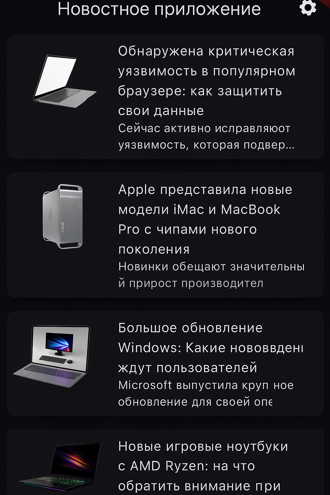
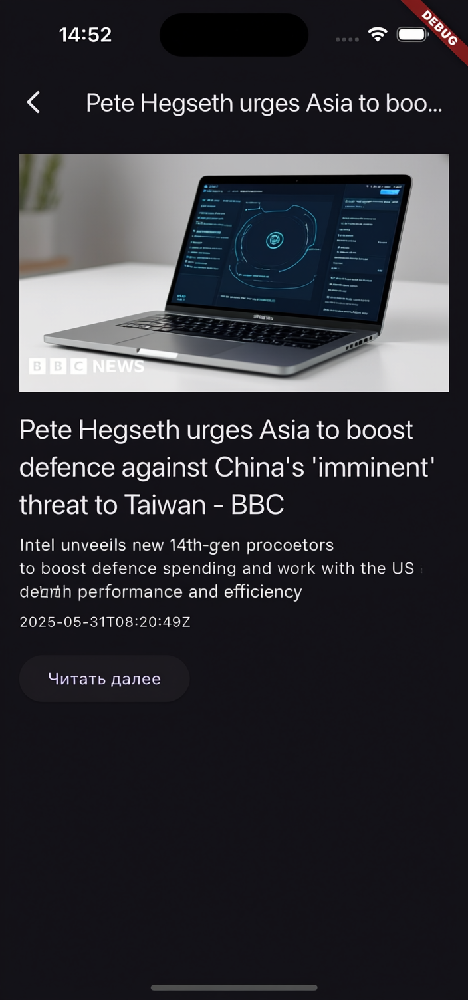
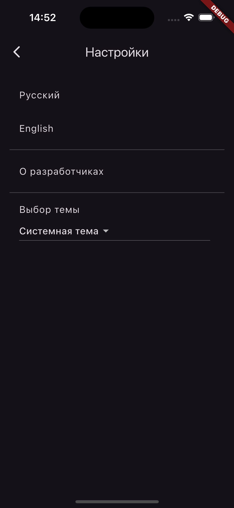
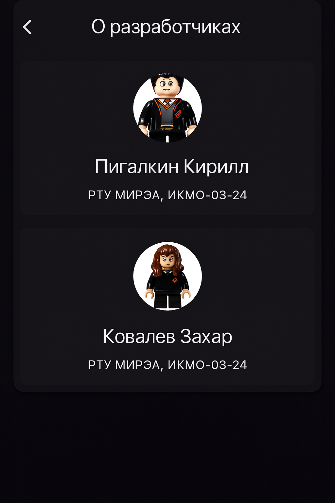

# News App

## Описание
Мобильное приложение для просмотра актуальных новостей, разработанное в рамках учебного курса МИРЭА. Приложение использует NewsAPI для получения новостных материалов и предоставляет удобный интерфейс для чтения статей. Реализована поддержка светлой и темной тем, многоязычный интерфейс (русский/английский), а также дополнительные функции: настройки приложения и информация о разработчиках.

---

## Функциональность

### 📰 Главный экран с новостями
- **Назначение**: Отображает ленту последних новостей с возможностью прокрутки
- **Особенности**: 
  - Заголовок, краткое описание и изображение для каждой новости
  - Автоматическая загрузка контента при запуске
  - Индикатор загрузки и обработка ошибок
- **Расположение**: `lib/screens/home_screen.dart`
- **Внешний вид**:
  

### 📖 Детальный просмотр статьи
- **Назначение**: Полноэкранный просмотр выбранной новости
- **Особенности**:
  - Полный заголовок и подробное описание
  - Изображение высокого качества
  - Дата публикации
  - Кнопка перехода к оригинальной статье
- **Расположение**: `lib/screens/article_screen.dart`
- **Внешний вид**:
  

### ⚙️ Экран настроек
- **Назначение**: Настройка параметров приложения
- **Особенности**:
  - Выбор языка интерфейса (русский/английский)
  - Переход к информации о разработчиках
  - Интеграция с системными настройками
- **Расположение**: `lib/screens/settings_screen.dart`
- **Внешний вид**:
  

### 👨‍💻 Информация о разработчиках
- **Назначение**: Представление команды разработчиков
- **Особенности**:
  - Интерактивные визитки с анимацией переворота
  - Кликабельные ссылки на GitHub и email
  - Стильный дизайн с плавными переходами
- **Расположение**: `lib/screens/about_screen.dart`
- **Внешний вид**:
  

---

## Технические особенности

### 🌐 Многоязычная поддержка
- Реализована через пакеты `intl` и `flutter_localizations`
- Поддержка русского и английского языков
- Автоматическое определение языка системы
- Файлы локализации: `app_localizations.dart`, `app_ru.arb`, `app_en.arb`

### 🎨 Темы оформления
- Адаптивные светлая и темная темы
- Автоматическое переключение согласно системным настройкам
- Единая цветовая палитра throughout приложения

### 🔐 Безопасность API
- Ключ API хранится в защищенном файле `.env`
- Использование пакета `flutter_dotenv` для управления конфиденциальными данными
- Корректная обработка ошибок API запросов

### 🏗️ Архитектура приложения
- Чистая архитектура с разделением на слои
- Сервисы для работы с API: `api_service.dart`
- Модели данных с автоматической сериализацией через `json_serializable`

---

## Установка и запуск

### Предварительные требования
- Установленный Flutter SDK
- API ключ от NewsAPI

### Пошаговая установка
1. Клонируйте репозиторий проекта
2. Установите зависимости: `flutter pub get`
3. Создайте файл `.env` в директории assets с содержимым:

NEWS_API_KEY=your_actual_api_key_here

4. Сгенерируйте код для моделей данных: `flutter pub run build_runner build`
5. Запустите приложение: `flutter run`

### Сборка релизной версии
- APK: `flutter build apk --release`
- App Bundle: `flutter build appbundle --release`

---

## Особенности реализации

### Обработка сетевых запросов
- Использование пакета `http` для API взаимодействия
- Таймауты и повторные попытки при сбоях
- Валидация ответов сервера

### Анимации и переходы
- Плавные анимации между экранами
- Интерактивные элементы с визуальной обратной связью
- Анимация переворота визиток на экране "О разработчиках"

### Состояние приложения
- Управление состоянием через встроенные средства Flutter
- Эффективное обновление UI при изменениях
- Сохранение настроек пользователя

---

## Возможности для расширения

- [ ] Кэширование новостей для офлайн-доступа
- [ ] Система избранных статей
- [ ] Push-уведомления о важных новостях
- [ ] Поиск по новостям
- [ ] Категории новостей
- [ ] Поделиться статьей
- [ ] Модульное тестирование

---

## Разработчики

**Команда проекта:**
- **Кирилл Пигалкин** - РТУ МИРЭА, ИКМО-03-24
- **Захар Ковалев** - РТУ МИРЭА, ИКМО-03-24

---

## Технологический стек

- **Фреймворк**: Flutter 3.0+
- **Язык**: Dart 3.0+
- **API**: NewsAPI
- **Библиотеки**: http, json_serializable, flutter_dotenv, url_launcher, intl

---

## Лицензия

Проект разработан в учебных целях. Все права на новостные материалы принадлежат их оригинальным источникам.

